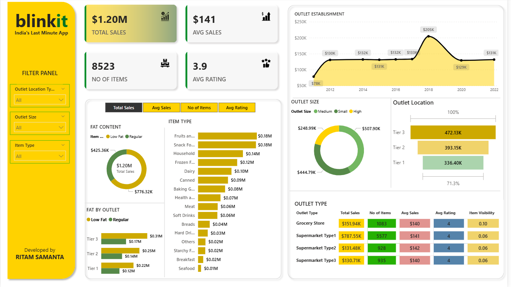

# Blinkit Data Analysis Dashboard - Power BI Project

This Power BI project presents an interactive dashboard for analyzing Blinkit's sales data. It offers deep insights into product categories, customer behavior, sales performance, and order trends, empowering businesses and analysts to make data-driven decisions.

## 📊 Dashboard Preview

---

## 🚀 Project Highlights & Insights

* **📦 Product-Level Insights:** Analyze top-performing products, brands, and categories to understand consumer preferences.
* **🛍️ Order Patterns:** Understand daily, weekly, and monthly order trends to identify peak purchasing times.
* **💸 Revenue Visualization:** Explore sales contributions by product type, fat content, and outlet location.
* **🧑‍🤝‍🧑 Customer & Outlet Analysis:** Evaluate how the outlet establishment year and location impact sales performance.
* **📍 Location-Based Analysis:** Pinpoint sales hotspots and delivery trends by outlet location.

---

## 🛠️ Tools & Technologies

* **Power BI Desktop:** For data modeling, visualization, and dashboard creation.
* **Power Query Editor:** For data cleaning, transformation, and ETL (Extract, Transform, Load).
* **DAX (Data Analysis Expressions):** For creating custom measures and calculated columns.
* **Excel / CSV:** As the primary data source.

---

## 🧱 Project Methodology

1.  **Requirement Gathering:** Defined the key business questions and required KPIs for the analysis.
2.  **Data Walkthrough:** Explored the dataset to understand its structure, columns, and data types.
3.  **Data Connection:** Connected to the source data in Power BI.
4.  **Data Cleaning & Processing:** Performed data quality checks, handled missing values, and transformed data using Power Query.
5.  **Data Modeling:** Created a relational model to link different data tables effectively.
6.  **DAX Calculations:** Developed DAX measures to calculate key metrics like Total Sales, Average Sales, etc.
7.  **Dashboard Design:** Created a clean and intuitive layout with custom backgrounds.
8.  **Visual Development:** Built and formatted charts and slicers to meet business requirements.
9.  **Report Finalization:** Assembled the final interactive dashboard.
10. **Insight Generation:** Derived actionable insights from the visualizations.

---

## 📈 Business Requirements & Visualizations

The dashboard was designed to answer the following key business questions:

* **Total Sales by Fat Content**
    * **Objective:** To analyze the impact of product fat content on total sales.
    * **Chart Type:** Donut Chart
    * **Key Metrics:** Total Sales, Average Sales, Number of Items, Average Rating.

* **Total Sales by Item Type**
    * **Objective:** To identify the sales performance of different item types.
    * **Chart Type:** Bar Chart
    * **Key Metrics:** Total Sales, Average Sales, Number of Items, Average Rating.

* **Total Sales by Outlet & Fat Content**
    * **Objective:** To compare sales across different outlets, segmented by product fat content.
    * **Chart Type:** Stacked Column Chart
    * **Key Metrics:** Total Sales, Average Sales, Number of Items, Average Rating.

* **Total Sales by Outlet Establishment Year**
    * **Objective:** To evaluate how the age or establishment year of an outlet affects its total sales.
    * **Chart Type:** Line Chart

---

## 📁 File Structure

| File Name                   | Description                                                                                  |
| --------------------------- | -------------------------------------------------------------------------------------------- |
| `BlinkIT Grocery Data.xlsx` | The primary Excel dataset used for this analysis.                                            |
| `Blinkit Project.pbit`      | The Power BI Template file. Use this to create a new project with the same report structure.   |
| `Dashboard_of_Blinkit.pbix` | The main Power BI project file, including the data model, queries, and the completed dashboard. |
| `Dashboard_preview.png`     | A full-screen preview image of the final dashboard.                                          |
| `README.md`                 | The documentation file for this project (this file).                                         |
